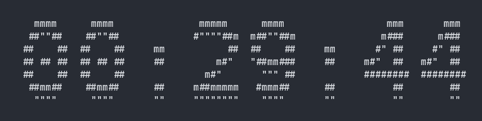

<h1 align="center"> PomoTUI </h1>
<p align="center">A pomodoro TUI with user notification to monitorate each pomo cycle.</p>

<p align="center">
    
    
</p>

### Motivation

Being a Neovim user, it is easier for me to use applications made in the terminal within TMUX itself in a way that allows greater usability between different tasks, therefore, I can run Pomodoro TUI as a background job or even leave a tab monitoring time with each pomodoro cycle.

### Dependencies

- figlet (v.2.5.5)
- notify-send (any)
- wget and unzip (any) if using WSL (to get the wsl-notify-send program)

### Execute

Put the program into $PATH variable inside .bashrc or .zshrc configuration file.

```bash
# inside .bashrc or .zshrc to assure PATH variable to be permanent overwritted
$ export POMO=$HOME/pomotui
$ export PATH=$POMO:$PATH
```

The pomodoro TUI program only accepts the <b>[minutes]</b> argument, e.g. to execute the pomodoro within 30 minutes break, you can run the CLI as:

```bash
$ export PATH=$PATH:pomo
$ pomo 30
```

> Made with :gift\_heart: by @marcos-c1 